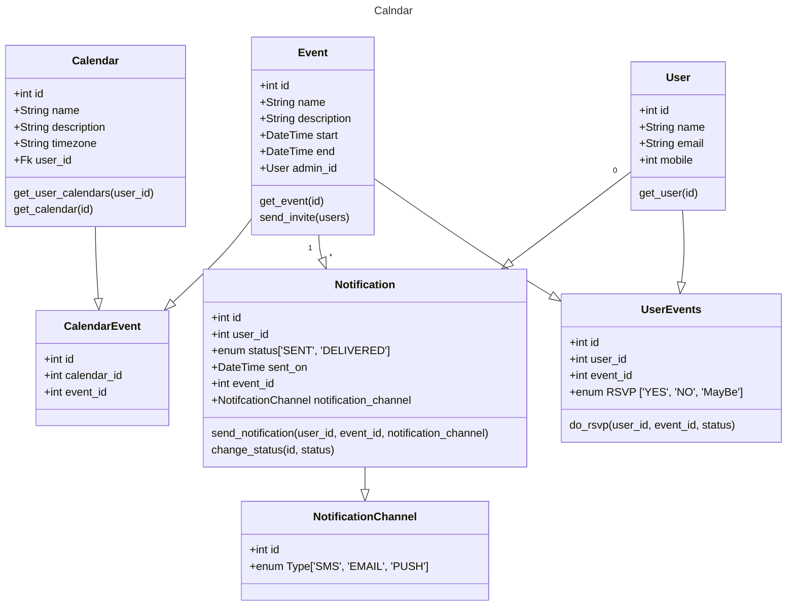

```mermaid
---
title: Calndar
---

classDiagram
    class User{
        +int id
        +String name
        +String email
        +int mobile
        get_user(id)
    }
        
        
    class Calendar{
        +int id
        +String name
        +String description
        +String timezone
        +Fk user_id
        get_user_calendars(user_id)
        get_calendar(id)
    }
        

    class Event{
        +int id
        +String name
        +String description
        +DateTime start
        +DateTime end
        +User admin_id 
        get_event(id)
        send_invite(users)
    }
    
    class CalendarEvent{
        +int id
        +int calendar_id
        +int event_id
    }
    
    Event --|>CalendarEvent
    Calendar --|>CalendarEvent
    
    class Notification{
        +int id
        +int user_id
        +enum status['SENT', 'DELIVERED']
        +DateTime sent_on
        +int event_id
        +NotifcationChannel notification_channel
        send_notification(user_id, event_id, notification_channel)
        change_status(id, status)
    }
    
    User "0" --|> "*" Notification
    Event "1" --|> "*" Notification
    Notification --|> NotificationChannel
    
    
    class NotificationChannel{
        +int id
        +enum Type['SMS', 'EMAIL', 'PUSH']
    }
    
    class UserEvents{
        +int id
        +int user_id
        +int event_id
        +enum RSVP ['YES', 'NO', 'MayBe']
        do_rsvp(user_id, event_id, status)
    }
    
    User --|> UserEvents
    Event --|> UserEvents
        
    
        


```