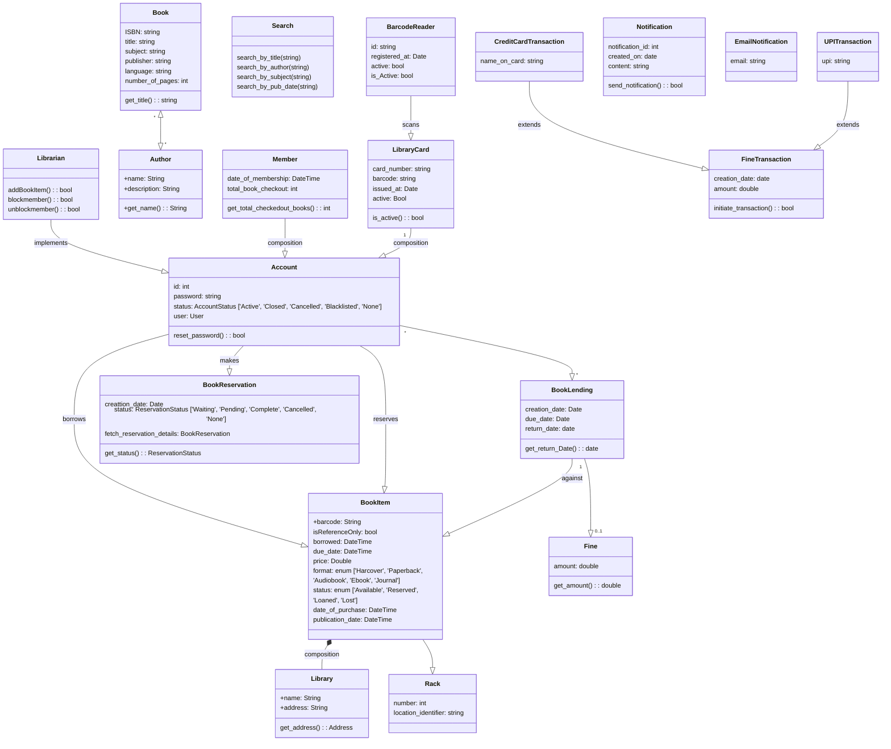

### Library Management System

#### Requirements

1. Search book by title, author, subject category, ISBN
2. unique identification number and other details including a rack number which will help to physically locate the book.
3. There could be more than one copy of a book, and library members should be able to check-out and reserve any copy.
4. The system should be able to retrieve information like who took a particular book 
5. what are the books checked-out by a specific library member.
6. Limit on at a time how many books a person can checkout
7. Limit on for how many days a person can keep a book.
8. Collect fines on book returned after due date
9. Notification on when a reserved book becomes available, and on book not returned on due date
10. Book and member card has bar code, system should be able to read the barcode from both.

#### Users 
1. Librarian: to add and modify book and items also member details, book issue details, reserve book,
2. Member: search, reserve, and issue, renew and return a book
3. System: to send notification for reservation, cancellation and renew

